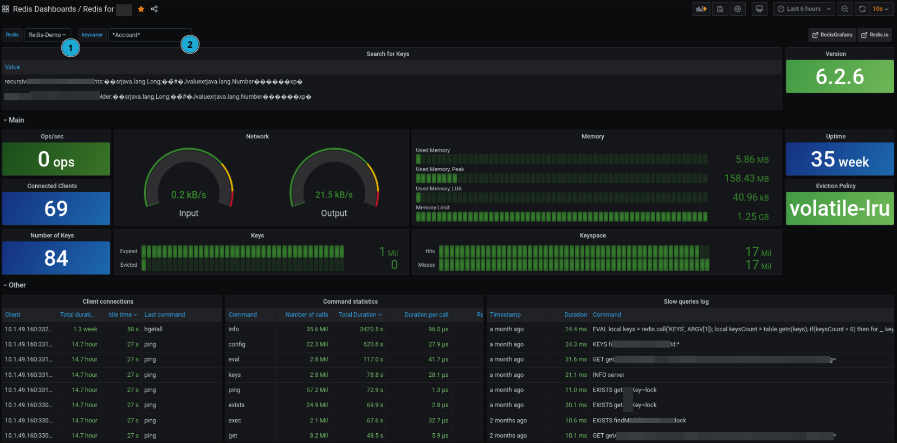

# Setup


### Connection to Redis:
```bash
redis-cli -a <password> -h <hostname> -p 6379

```

### Clear cache

```bash
redis-cli -a <password> -h <hostname> -p 6379 flushall
```

### Search for a key
```bash
redis-cli -a <password> -h <hostname> -p 6379
# search for a key:
keys *pattern*
```


## Dashboard with Grafana & Prometheus



# Quick Links
[Redis CLI](https://redis.io/docs/latest/develop/tools/cli/)
